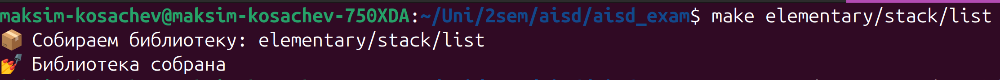
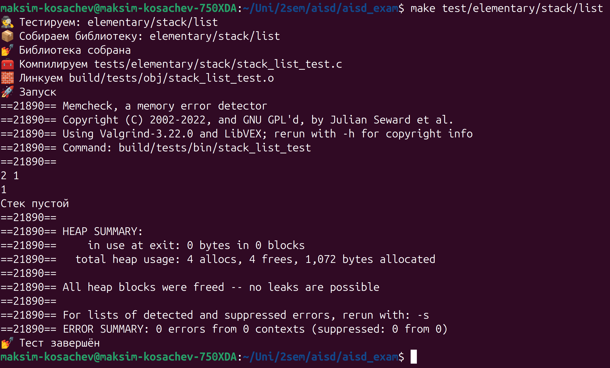

# Подготовка к экзамену по аисду
Данный проект представляет собой реализацию структур данных из курса МИФИ АИСД2025(12 кафедра) на языке C \
Старался делать по бабушкиным лекциям


## Содержание
- [Технические требования](#технические-требования)
- [Запуск](#запуск)
- [Скриншоты](#скриншоты)
- [Доступные структуры данных](#доступные-структуры-данных)
- [Тесты](#тесты)
- [Источники](#источники)


## Технические требования
Для работы с проектом понадобятся:
- [Valgrind](https://valgrind.org/)
- [Make](https://www.gnu.org/software/make/)
- [Graphviz](https://graphviz.org/) 

### Установка
```bash
$ sudo apt install valgrind make graphviz
```

## Запуск
### Сборка библиотеки
```bash
$ make <раздел>/<структура>/<реализация>
```

### Запуск тестового файла
```bash
$ make test/<раздел>/<структура>/<реализация>
```

## Скриншоты
### Сборка библиотеки


### Тестирование



## Доступные структуры данных
- [Элементарные структуры данных](src/elementary/) \
    - [Стек](src/elementary/stack/)
        - [На векторе](src/elementary/stack/vector/)
        - [На списке](src/elementary/stack/list/)
    - [Линейная очередь](src/elementary/linear_queue/)
        - [На векторе](src/elementary/linear_queue/vector/)
        - [На списке](src/elementary/linear_queue/list/)
    - [Циклическая очередь](src/elementary/circular_queue/)
        - [На векторе](src/elementary/circular_queue/vector/)
        - [На списке](src/elementary/circular_queue/list/)
    - [Дек](src/elementary/deque/)
        - [На векторе](src/elementary/deque/vector/)
        - [На списке](src/elementary/deque/list/)
    - [Матрица](src/elementary/matrix/)
        - [Прямоугольная матрица(та, что из вышмата)](src/elementary/matrix/rectangular/)

## Тесты
Тесты лежать в папке [tests/](tests/). Если хотите, можете поиграться с ними


## Источники
- [Valgrind](https://valgrind.org/)
- [Make](https://www.gnu.org/software/make/)
- [Graphviz](https://graphviz.org/) 
- [Бабушкины лекции](https://drive.google.com/drive/folders/13QkPclgH0022mntpWTGR9Y0c86SckLhv?usp=sharing)
- [Лекторий ФПМИ](https://youtube.com/playlist?list=PL4_hYwCyhAvZ9ObmpO7n9eyg-FS5H3TQ6&si=UBqdt_hgFjCZetHT)
- [GeekforGeeks](https://www.geeksforgeeks.org/dsa-tutorial-learn-data-structures-and-algorithms/)
- [Qwen](https://chat.qwen.ai)